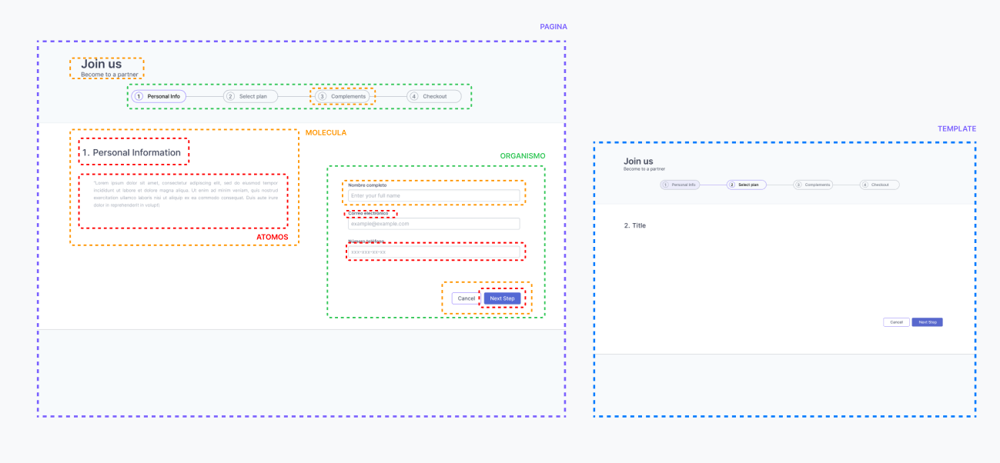
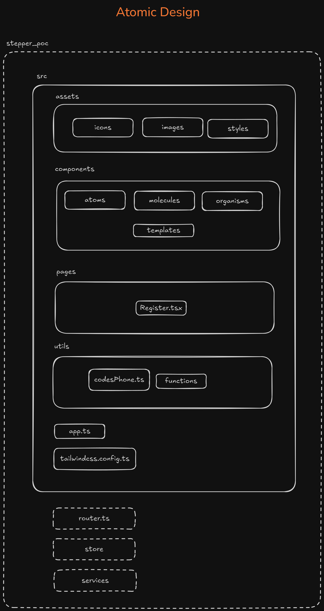

# Design Document: Multi-step Subscription Form 🚀

## Project Overview
A multi-step subscription form built with React, TypeScript, Tailwind CSS, shadcn/ui, and Zustand, following Atomic Design principles.

## Tech Stack
- React + TypeScript
- Tailwind CSS
- shadcn/ui
- Zustand
- Node V21.1.0

## Architecture Overview

### 1. Atomic Design Structure



#### Atoms (Basic Components)
- Input fields (text, email, phone)
- Labels
- Error messages
- Checkboxes
- Toggle switch (monthly/yearly billing)
- Buttons (Next, Cancel)
- Progress indicators
- Price tags

#### Molecules (Composite Components)
- Form field groups (label + input + error)
- Plan card (title, price, description, features)
- Additional card (checkbox + title + description + price)
- Summary item (service + price)
- Step indicator (number + title)

#### Organisms (Complex Components)
- Personal information form (Step 1)
- Plan selection form (Step 2)
- Additional selection form (Step 3)
- Summary form (Step 4)
- Navigation controls
- Progress bar

#### Templates
- Step layout template
- Mobile layout template
- Desktop layout template

#### Pages
- Main stepper page

### 2. File Structure



```
src/
├── assets/
│   ├── icons/
│   ├── images/
│   └── styles/
├── components/
│   ├── atoms/
│   │   ├── Button/
│   │   ├── Input/
│   │   ├── Label/
│   │   └── ErrorMessage/
│   ├── molecules/
│   │   ├── FormField/
│   │   ├── PlanCard/
│   │   ├── AddOnCard/
│   │   └── StepIndicator/
│   ├── organisms/
│   │   ├── PersonalInfoForm/
│   │   ├── PlanSelectionForm/
│   │   ├── AddOnsForm/
│   │   └── SummaryForm/
│   └── templates/
│       ├── StepLayout/
│       └── FormLayout/
├── pages/
│   └── RegisterForm/
├── utils/
│   ├── validation.ts
│   └── formatters.ts
├── store/
│   └── useFormStore.ts
├── services
│   └── serviceMock.ts
├── router.ts
|-- tailwind.config.js
|-- tsconfig.json
|-- vite.config.ts
└── app.ts
```